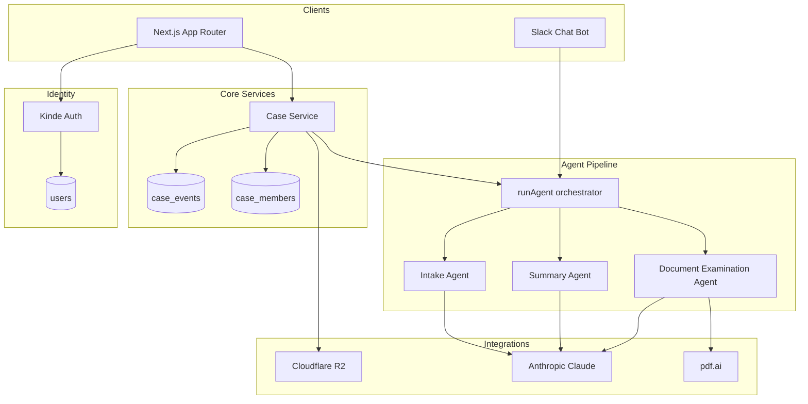

# gett Architecture

Medical leave compliance platform where **verifiability** is a first-class requirement. Every case mutation is auditable, authorization is enforced at the service layer, and PHI boundaries are explicit.

## System Overview



## Compliance Engineering

### Audit trails (append-only)

All case mutations write to `case_events` via `appendCaseEvent` / `logCaseEvent`:

| Action | Trigger |
|--------|---------|
| `case.created` | New case + owner membership |
| `case.status_updated` | Status workflow transition |
| `case.member_added` | Access grant |
| `document.uploaded` | PDF upload + SHA-256 |
| `agent.intake.completed` | Intake agent run |
| `agent.summary.completed` | Summary agent run |
| `agent.examination.completed` | Document examination |

Events are **never updated or deleted** in application code. Retention policies (future) archive to cold storage rather than hard-delete.

### Immutable case identity

- Stable UUID (`cases.id`) and verifiable hash (`cases.case_hash`, format `GETT-XXXXXXXXXXXX`).
- Hash is unique and indexed — safe for external references without exposing internal IDs.

### Least-privilege access

```
users ──< case_members >── cases
              └── role: owner | member | lawyer | viewer
```

- **Service layer**: `requireCaseMember`, `getCaseForUser` before reads/writes.
- **tRPC**: `protectedProcedure` + `caseProcedure(minRole)`.
- **Middleware**: Kinde guards `/dashboard`, `/cases` (defense-in-depth).

| Role | Read | Mutate | Add members | Run agents |
|------|------|--------|-------------|------------|
| owner | ✓ | ✓ | ✓ | ✓ |
| member | ✓ | limited | ✗ | ✓ |
| lawyer | ✓ | ✓ | ✓ | ✓ |
| viewer | ✓ | ✗ | ✗ | ✗ |

### PHI handling boundaries

- **Store**: titles, status, document metadata (filename, SHA-256, pdf.ai ID), structured event payloads.
- **Do not store in events**: full document text, raw clinical details.
- **Agents**: reference document IDs + citation placeholders only.
- **Future**: encrypted object storage, BAA-covered vendors, residency controls.

### Document provenance

`documents`: `sha256`, `storageKey`, `storageBucket`, `pdfAiDocId`, `extractedText` (processing artifact), `uploaded_by`.

Upload flow: hash → R2 upload (or placeholder key) → pdf.ai extract (or stub) → DB row → `document.uploaded` event.

Storage key pattern: `{caseId}/{documentId}/{filename}` in bucket `gett-cases`.

### Document storage (Cloudflare R2)

S3-compatible object storage via `@aws-sdk/client-s3`:

| Bucket | Purpose |
|--------|---------|
| `gett-cases` | Case PDF uploads (user documents) |
| `legalcorpus` | Legal reference corpus (future agent/search) |

Client: `src/server/storage/r2.ts` — `uploadToBucket`, `getFromBucket`, `deleteFromBucket`.

Legal corpus stub: `src/server/storage/legal-corpus.ts`.

When `R2_*` credentials are unset, uploads use a `placeholder/…` storage key so local dev and CI builds remain unblocked.

Env: `R2_ACCOUNT_ID`, `R2_ACCESS_KEY_ID`, `R2_SECRET_ACCESS_KEY`, optional `R2_ENDPOINT`, `R2_PUBLIC_URL`, bucket name overrides.

### Retention hooks (planned)

- Case closure timers, legal hold flag, SIEM export.

---

## Identity

Kinde session → `resolveCurrentUser()` → upsert `users` by `kindeId`.

Files: `src/server/auth/session.ts`, `src/server/auth/get-current-user.ts`

---

## Agent Pipeline

| Agent | Entry | Tools |
|-------|-------|-------|
| **intake** | `runIntakeAgent` / `agent.intake` | `create_case`, `get_case`, `append_audit_event` |
| **summary** | `runSummaryAgent` / `agent.summarize` | case + document context |
| **document_examination** | `runExamineDocumentAgent` / `agent.examineDocument` | structured examination output |

Unified entry: `runAgent()` in `src/server/agents/orchestrator.ts`

Stub mode when `ANTHROPIC_API_KEY` is unset — returns placeholder output, still logs audit events where applicable.

---

## Ticketing

Status enum: `open` → `in_review` → `pending_lawyer` → `closed`

Service: `src/server/services/cases.ts`  
tRPC: `src/server/api/routers/case.ts`

---

## Integrations

### Kinde Auth

- Middleware: `src/middleware.ts`
- Lazy route handlers: `src/app/api/auth/[kindeAuth]/route.ts`
- Env: `KINDE_*` in `src/env.js`

### pdf.ai

- Client: `src/server/pdf/client.ts` (upload + extract)
- Placeholder: `src/server/integrations/pdf-ai.ts` (extended API surface)
- Upload service: `src/server/pdf/upload.ts`

### Cloudflare R2

- Client: `src/server/storage/r2.ts`
- Legal corpus stub: `src/server/storage/legal-corpus.ts`
- Env: `R2_*` in `src/env.js`

### Chat SDK (Slack intake)

Scaffold: `src/server/chat/bot.ts`

**Chat → case intake (planned)**:

1. User DMs bot or `/gett-intake`
2. Map Slack user → `users` row (OAuth link, TODO)
3. `runAgent(..., "intake", message)` with authenticated user
4. Reply with `case_hash`
5. Webhook: `src/app/api/chat/slack/route.ts` (future)

---

## Database Schema

| Table | Purpose |
|-------|---------|
| `gett_user` | Internal identity (`kindeId`) |
| `gett_case` | Case + `GETT-*` hash + status |
| `gett_case_member` | Authorization join |
| `gett_case_event` | Append-only audit |
| `gett_document` | Document provenance |

```bash
pnpm db:generate   # after schema changes
pnpm db:push       # apply locally
```

---

## API Surface

| Route | Auth | Purpose |
|-------|------|---------|
| `/api/auth/*` | Public | Kinde OAuth |
| `case.*` tRPC | Session | Case CRUD, audit log |
| `agent.*` tRPC | Session | Agent runs |
| `document.*` tRPC | Session + case role | PDF upload |
| `/dashboard` | Kinde | Case list |
| `/cases/[caseId]` | Kinde + membership | Detail + agent stub |

---

## Local Development

```bash
cp .env.example .env
# Set DATABASE_URL + Kinde credentials

pnpm db:push
pnpm dev
```

Build without all secrets:

```bash
SKIP_ENV_VALIDATION=true pnpm run build
```

Kinde vars are still required at **runtime** for auth routes; use placeholders from `.env.example`.
